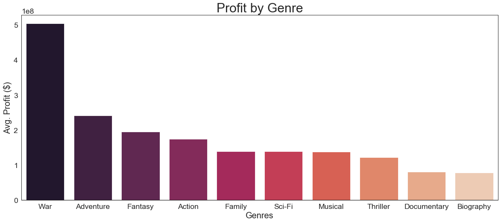
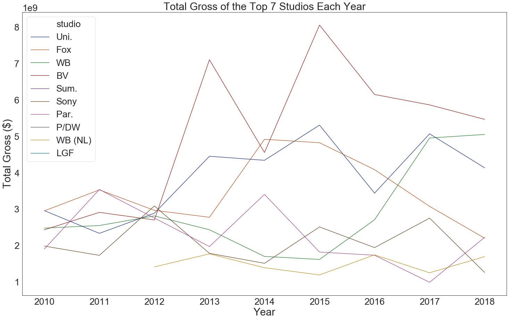
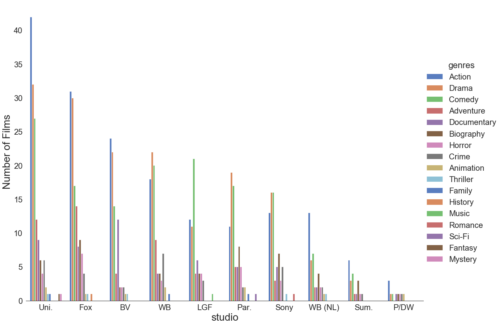
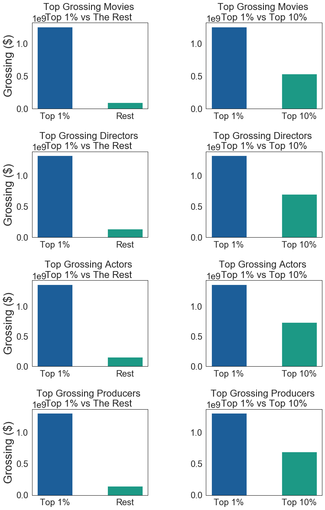
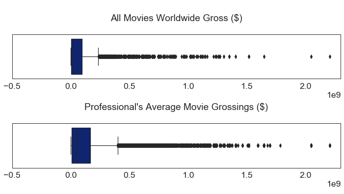

# Analysis of Various Characteristics of Best Films in Recent Times 

## Table of Contents  

* [General Info](#GeneralInfo)

 * [Technologies](#Technologies)
  
  * [Data Overview](#DataOverview)

* [Questions, Insights & Recommendations](#Questions,Insights&Recommendations)

* [Further Investigation](#FurtherInvestigation)

* [Conclusion](#Conclusion)

<a name="General Info"/>

<a name="Technologies"/>

<a name="DataOverview"/>

<a name="Questions,Insights&Recommendations"/>

<a name="FurtherInvestigation"/>

<a name="Conclusion"/>

## General Info

The project was assigned as the final part of the Module 1 in Flatiron School's Data Science Program. The brief is detailed below:

"Microsoft sees all the big companies creating original video content, and they want to get in on the fun. They have decided to create a new movie studio, but the problem is they don’t know anything about creating movies. They have hired you to help them better understand the movie industry. Your team is charged with doing data analysis and creating a presentation that explores what type of films are currently doing the best at the box office. You must then translate those findings into actionable insights that the CEO can use when deciding what type of films they should be creating."

The project centers around the hypothetical scenario in which Microsoft is entering the movie production business. As a Data Scientist I have been tasked with analysing public movie databases (Rotten Tomatoes, IMDB, TMDB, and Box Office Mojo) and determining what characteristics of films make them do"best" at box office. It was our decision to use profit and gross as the predominant indicators of success. We explored several characteristic's impact to film's box office grossing and profit.

### Technologies 

This project was created using the following languages and libraries. An environment with the correct versions of the following allows for re-production and improvement on this project.

* Python version: 3.6.9
 * glob
 * os
 
 
* Matplotlib version: 3.1.1

* Pandas version: 3.1.1

* Numpy version: 1.16.5

* Seaborn version: 0.9.0

### Data Overview

The datasets included a wide range of related data as below in .csv files:

* Box Office Mojo:

   - bom.movie_gross.csv.gz
  
  
* IMDB:          

  - imdb.title.crew.csv.gz
  - imdb.title.akas.csv.gz
  - imdb.title.ratings.csv.gz
  - imdb.name.basics.csv.gz
  - imdb.title.basics.csv.gz
  - imdb.title.principals.csv.gz
  
  
* TMDB:

  - tmdb.movies.csv.gz
  
  
* The Numbers:

  - tn.movie_budgets.csv.gz
  
  
 

After initial analysis and some data cleaning, the datasets which we used for our analysis were:

* tn.movie_budgets.csv.gz for __financial & studio data__

* bom.movie_gross.csv.gz for __financial data__

* imdb.title.basics.csv.gz for __genre data__

* imdb.title.akas.csv.gz for __Directors, Actors & Producers data__

## Questions, Insights & Recommendations

### Don't discount Genre, if you're looking to make money...

Right, we couldn't start without having a look at what genres make the most money. There are many types of genre, each averaging a wide distribution of profit since 2010. Based on the data available, the top 5 averaging film genres were Adventure, War, Musical, Fantasy and Family. Interestingly, Adventure films tend to average more than twice as much profit to Thriller, Animation and Documentary. The average of profit was taken to account for the number of films produced in each genre. We assumed that the mean would be the most reliable average with the data we had, and another assumption was that films have a single genre.

Taking a look at the top 12 genres over time, we are able to paint a picture of the total amount of profit produced by each genre over the years (2010 - 2018). Action has produced the most amount profit over the years, the majority of the time. This graph could be considered a reflection of whether genres have been increasing or decreasing in popularity in recent times. From 2016 - 2018, Action films have been producing a steep increase in Total Profit.

Our recommendation would be, if you are looking for a gamble then Adventure, War, Musical, Fantasy could produce some great results. The leading profit genres (Action, Drama, Adventure) paint the more reliable story, and genre Action appears to be increasing in popularity.

### You have plenty of competition!

The movie production industry is a competitive arena, and to be the best you have to beat the best. We've taken a deeper dive into which studios will be our most successful competitors. Based on the data available, Walt Disney has been a leader in total gross production between 2015-2018, followed by Universal Studios and Warner Brothers. Here we assumed that the Total Gross produced by a Studio would be an indicator of whether they are a market leader.

| Abbreviation     | Studio                                    |
|-----------------|-------------------------------------------|
|        Uni.     | Universal Pictures                        |
| Fox             |        20th Century Fox                   |
| WB              | Warner Bros.                              |
| BV              | Walt Disney Studios                       |
| Sum.            |         Summit   Entertainment            |
| Sony            |        Sony Pictures Motion Picture Group |
| Par.            |        Paramount Pictures                 |
| P/DW            |        DreamWorks Pictures                |
| WB (NL)         | New Line Cinema                           |
| LGF             |        Lionsgate Films                    |

Below we have considered the types and number of films that our competitors are making. Universal Studios and 20th Century Fox have produced the largest amount leading films by gross, their focus has been on Action and Drama. All through the list, there is a common theme of the leaders producing films in the genres of Action, Drama and Comedy. We would recommend doing the same for consistent results.

                   The Types of Films Industry Leaders are Making

### Make sure you pick the movie's Director wisely!

Directors, actors, producers - there's so many things to think about. People's opinions tend to differ when it comes to what makes a great movie, a common discussion tends to focus around these 3 roles. So we decided to have a look at if there were common themes amongst the leaders in these fields. In the data below, we have shown a comparison of top 1%/10%/Rest of these job roles effect on average grossing. From the graphs above, it appears directors have the most impact on grossing. The proportion between top 1% and the rest is more skewed for directors than actors, producers, or top movies. Saying that, the results of all 3 are similar.

The charts below are not radically different. However, we can note that:
The bottom 25% of professionals present worse financial performances than the bottom 25% of all movies. We can thus infer that low performing professionals have an out sized negative impact on the financial performance of a movie.

## Further Investigation

### Investigate further into Film Finances

Typically film production datasets do not go that deep, and tend to the very well guarded. From further exploration of what exactly goes into a film production budget and whether they are all encompassing, it would provide a more colourful picture into the accuracy of the data provided in these datasets. I'd be interested in scraping more financial data from additional sources and going more granular.

### The Netflix Effect

With more time and data, it would be interesting to explore the effects streaming platforms are having on box office profits in the film industry. This could lead to some interesting insights around partnerships. Furthermore, a discovery into what these types of films would recommend making based on their own data would be super helpful.

### Understand The Success Metric

We've only considered two metrics for the 'best' types of movies, which we decided would be profit and grossing. There are multiple variables that can be explored. To mention a few:

* ROI
* Ratings
* Views on streaming platforms

## Conclusion

Preparation, modeling, visualisation and interpretation of the data, allowed us to conduct analysis of the movies that have been created since 2010. 

__Key Takeaways__

* Adventure films on average are the most profitable

* The industry leaders preferred creating Action, Drama & Comedy films

* Director choice will have the most impact on grossing

Thank you for taking the time to read through this movie exploration.
